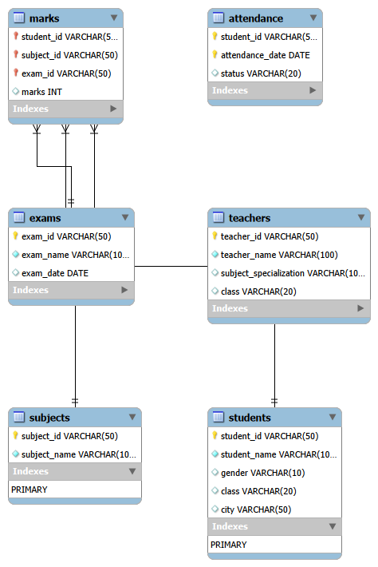

# 📊 School Performance Analysis System (End-to-End SQL Project)

## 🧠 Project Overview

This project simulates a real-world School Data Analytics System designed to help
school management (principal, teachers, and administration) understand student
performance, attendance, and subject-wise trends.

The goal is to transform raw school data into actionable insights that support
better academic decision-making.

> **Scope note:** This project is SQL-only, focused on database design, query
> writing, and analytical thinking. A Power BI/Tableau dashboard layer is a
> planned future extension.

---

## 🎯 Problem Definition

The school is facing several challenges:

- Students are underperforming in certain subjects
- No proper tracking of student performance
- Attendance impact is unclear
- No ranking system for students
- Need for data-driven decision-making

---

## ❓ Business Questions

1. How many students are currently enrolled in the school?
2. What marks has each student scored in every subject?
3. Which subjects have the highest and lowest average performance across students?
4. Who is the top scorer in each subject?
5. What is each student's overall academic performance (total marks)?
6. What is each student's average performance across all subjects?
7. Which students are excelling — scoring above 80 in any subject?
8. Which students are at risk — scoring below the passing threshold (40) in any subject?
9. Which subjects are underperforming school-wide, with an average below 50?
10. How regularly does each student attend school?
11. Which students are performing above the overall school average?
12. Who are the top 5 highest-performing students in the school?
13. How do all students rank against each other based on total performance?
14. How does each student rank within each individual subject?
15. How far above or below the subject average is each student performing?

---

## 📂 Data Source

The dataset for this project was generated using AI to simulate a school
management system. It contains the following tables:

- `students`
- `teachers`
- `subjects`
- `exams`
- `marks`
- `attendance`

> Note: This is synthetic data generated for educational and portfolio purposes
> and does not contain real-world information.

## 🗂️ Database Structure

Tables used in this project:
- students
- subjects
- teachers
- exams
- marks
- attendance

---

## 🔍 Analytical Process

Understand Problem → Define Business Questions → Assess Data Quality → Clean &
Model Data → Write SQL Queries → Analyze Output → Generate Insights → Provide
Recommendations

---

## 🗂️ Database Schema(create tables)


```sql
-- =========================================
-- Create the database for school analytics system
-- =========================================
create database school_analytics;

```

```sql
-- =========================================
-- Select the database to start working on it
-- =========================================
use school_analytics;

```


```sql
-- =========================================
-- Create students table
-- =========================================
CREATE TABLE students (
     student_id VARCHAR(50) PRIMARY KEY,
     student_name VARCHAR(100) NOT NULL,
     gender VARCHAR(10),
     class VARCHAR(20),
     city VARCHAR(50)
);

```

```sql
-- =========================================
-- Create subjects table
-- =========================================
CREATE TABLE subjects (
    subject_id VARCHAR(50) PRIMARY KEY,
    subject_name VARCHAR(100) NOT NULL
);

```


```sql
-- =========================================
-- Create exams table
-- =========================================
CREATE TABLE exams (
    exam_id VARCHAR(50) PRIMARY KEY,
    exam_name VARCHAR(100) NOT NULL,
    exam_date DATE
);

```

```sql
-- =========================================
-- Create teachers table
-- =========================================
CREATE TABLE teachers (
    teacher_id VARCHAR(50) PRIMARY KEY,
    teacher_name VARCHAR(100) NOT NULL,
    subject_specialization VARCHAR(100),
    class VARCHAR(20)
);

```

```sql
-- =========================================
-- Create marks table
-- =========================================
CREATE TABLE marks (
    student_id VARCHAR(50),
    subject_id VARCHAR(50),
    exam_id VARCHAR(50),
    marks INTEGER,

    PRIMARY KEY (student_id, subject_id, exam_id),

    FOREIGN KEY (student_id)
        REFERENCES students(student_id),

    FOREIGN KEY (subject_id)
        REFERENCES subjects(subject_id),

    FOREIGN KEY (exam_id)
        REFERENCES exams(exam_id)
);

```

```sql
-- =========================================
-- Create attendance table
-- =========================================
CREATE TABLE attendance (
    student_id VARCHAR(50),
    attendance_date VARCHAR(50), -- Temporarily text to safely accept "General" data
    status VARCHAR(20),
    PRIMARY KEY (student_id, attendance_date)
);

```
---

## 🗄️ Database Schema (ER Diagram)



---

## 🔄 Data Type Modifications

```sql
-- =========================================
-- Change the data type of the marks column to INT
-- =========================================
alter table marks
modify column marks int;

```

```sql
-- =========================================
-- Change the data type of the attendance_date column to DATE
-- =========================================
alter table attendance
modify column attendance_date date;

```

```sql
-- =========================================
-- Change the data type of the exam_date column to DATE
-- =========================================
alter table exams
modify column exam_date date;

```
---

## 📊 Data Overview (Cleaned Tables)

```sql
-- =========================================
-- Students table
-- =========================================
SELECT * FROM students;

```

## Dataset

👨‍🎓 Students Dataset → [View](clean_data/students.csv)


```sql
-- =========================================
-- Subjects table
-- =========================================
SELECT * FROM subjects;

```

## Dataset

📚 Subjects Dataset → [View](clean_data/subjects.csv)


```sql
-- =========================================
-- Exams table
-- =========================================
SELECT * FROM exams;

```

## Dataset

📝 Exams Dataset → [View](clean_data/exams.csv)


```sql
-- =========================================
-- Teachers table
-- =========================================
SELECT * FROM teachers;

```

## Dataset

👩‍🏫 Teachers Dataset → [View](clean_data/teachers.csv)


```sql
-- =========================================
-- Marks table
-- =========================================
SELECT * FROM marks;

```

## Dataset

📊 Marks Dataset → [View](clean_data/marks.csv)


```sql
-- =========================================
-- Attendance table
-- =========================================
SELECT * FROM attendance;

```

## Dataset

🏫 Attendance Dataset → [View](clean_data/attendance.csv)

---

## 🏫 Student Performance Analysis

```sql
-- =========================================
-- Show total number of students in the school
-- =========================================
select 
count(*) as total_students
from students;

```

## 📊 Output  
[View Output](Analysis_outputs/total_students.csv)


```sql
-- =========================================
-- Show each student with their marks in all subjects
-- =========================================
select 
st.student_name,
su.subject_name,
m.marks
from students st
join marks m
on m.student_id = st.student_id
join subjects su
on su.subject_id = m.subject_id
order by st.student_name,su.subject_name;

```

## 📊 Output  
[View Output](Analysis_outputs/student_with_their_marks_in_all_subjects.csv)


```sql
-- =========================================
-- Find average marks of each subject
-- =========================================
select 
s.subject_id,
s.subject_name,
avg(m.marks) as avg_marks
from marks m
join subjects s
on m.subject_id = s.subject_id
group by subject_id
order by avg_marks;

```

## 📊 Output  
[View Output](Analysis_outputs/avg_marks_of_each_subject.csv)


```sql
-- =========================================
-- Find the highest marks in each subject
-- =========================================
select
s.subject_id,
su.subject_name,
max(m.marks) as highest_marks
from marks m
join subjects su
on m.subject_id = su.subject_id
group by su.subject_name
order by highest_marks desc;

```
## 📊 Output  
[View Output](Analysis_outputs/highest_marks_in_each_subject.csv)


```sql
-- =========================================
-- Find total marks obtained by each student
-- =========================================
select 
st.student_id,
st.student_name,
sum(m.marks) as total_marks
from marks m
join students st
on m.student_id = st.student_id
group by st.student_id,st.student_name
order by total_marks;

```

## 📊 Output  
[View Output](Analysis_outputs/total_marks_obtained_by_each_student.csv)


```sql
-- =========================================
-- Find average marks per student
-- =========================================
select 
st.student_id,
st.student_name,
avg(m.marks) as avg_marks
from marks m
join students st
on m.student_id = st.student_id
group by st.student_id,st.student_name
order by avg_marks desc;

```

## 📊 Output  
[View Output](Analysis_outputs/average_marks_per_student.csv)


```sql
-- =========================================
-- Show students who scored more than 80 in any subject
-- =========================================
select 
st.student_name,
su.subject_name,
m.marks
from students st
join marks m
on m.student_id = st.student_id
join subjects su
on su.subject_id = m.subject_id
where m.marks > 80
order by m.marks desc;

```

## 📊 Output  
[View Output](Analysis_outputs/students_who_scored_more_than_80_in_any_subject.csv)


```sql
-- =========================================
-- Find students who are failing (less than 40 marks in any subject)
-- =========================================
select 
st.student_id,
st.student_name,
su.subject_name,
m.marks 
from students st
join marks m
on st.student_id = m.student_id
join subjects su
on su.subject_id = m.subject_id
where m.marks < 40;

```

## 📊 Output  
[View Output](Analysis_outputs/students_who_are_failing.csv)


```sql
-- =========================================
-- Find subjects where average marks are below 50
-- =========================================
select 
su.subject_id,
su.subject_name, 
avg(m.marks) as avg_marks
from subjects su
join marks m
on su.subject_id = m.subject_id
group by  su.subject_id,su.subject_name
having avg_marks < 50
order by avg_marks desc;

```

## 📊 Output  
[View Output](Analysis_outputs/subjects_where_average_marks_are_below_50.csv)


```sql
-- =========================================
-- Show attendance percentage of each student
-- =========================================
select 
st.student_id,
st.student_name,
round(count(case when a.status in ('Present','Late') then 1 end)*100.00/nullif(count(a.attendance_date),0),2) as attendance_percentage
from attendance a
join students st
on a.student_id = st.student_id
group by st.student_id,st.student_name
order by attendance_percentage desc;

```

## 📊 Output  
[View Output](Analysis_outputs/attendance_percentage_of_each_student.csv)


```sql
-- =========================================
-- Find students whose marks are above class average
-- =========================================
select 
st.student_id,
st.student_name,
m.marks
from students st 
join marks m
on st.student_id = m.student_id
where m.marks > (select avg(marks)
from marks)
order by m.marks desc;

```

## 📊 Output  
[View Output](Analysis_outputs/students_whose_marks_are_above_class_average.csv)


```sql
-- =========================================
-- Show top 5 students based on total marks.
-- =========================================
select 
st.student_id,
st.student_name,
sum(m.marks) as total_marks
from students st
join marks m
on st.student_id = m.student_id
group by st.student_id,st.student_name
order by total_marks desc
limit 5;

```

## 📊 Output  
[View Output](Analysis_outputs/top_5_students_based_on_total_marks.csv)


```sql
-- =========================================
-- Rank students based on total marks (highest to lowest)
-- =========================================
select 
st.student_id,
st.student_name,
sum(m.marks),
rank() over(order by sum(m.marks) desc) as student_rank
from students st
join marks m
on st. student_id = m.student_id
group by st.student_id,st.student_name ;

```

## 📊 Output  
[View Output](Analysis_outputs/Rank_of_students_based_on_total_marks.csv)


```sql
-- =========================================
-- Show each student’s rank per subject
-- =========================================
select 
su.subject_id , 
su.subject_name,
st.student_id,
st.student_name,
m.marks as subject_marks,
rank() over(partition by su.subject_id order by m.marks desc)
from students st
join marks m 
on st.student_id=m.student_id
join subjects su
on su.subject_id = m.subject_id;

```

## 📊 Output  
[View Output](Analysis_outputs/student’s_rank_per_subject.csv)


```sql
-- =========================================
-- Find the difference between a student’s marks and class average (per subject)
-- =========================================
select 
su.subject_id,
su.subject_name,
st.student_id,
st.student_name,
m.marks,
avg(m.marks) over(partition by su.subject_id) as avg_marks,
m.marks - avg(m.marks) over(partition by su.subject_id ) as difference_from_avg 
from students st
join marks m
on st.student_id = m.student_id
join subjects su
on su.subject_id = m.subject_id;

```
## 📊 Output  
[View Output](Analysis_outputs/difference_between_a_student’s_marks_and_class_average_per_subject.csv)

---

## 📊 Key Insights

**Subject Performance**
> **Math 20** has the lowest average marks across all students, at **36**, while **Urdu 7** performs best with an average of **100**. This gap suggests that sujects having low average marks may need curriculum review or additional teaching support.

**Failing Students**
> **22** students scored below 40 marks in at least one subject, out of **151** total students (**14.57%** of the student body). The subjects with the most failing scores are **Science 16, History 9, Geography 14 and Islamiat 4**, accounting for **2** of these cases.

**Top Performers**
> The top 5 students by total marks scored between **189** and **294**, led by **Ali Ali** with a total of **294**. These students appear consistently high-ranked across multiple subjects, not just one.

**Attendance & Performance**
> Students with attendance above **50.50** had an average mark of **62.28**, compared to **66.48** for students with attendance below that threshold. This indicates attendance has a **weak** relationship with academic performance.

**Subjects Below Passing Average**
> **___** subjects have a class average below 50 marks: **[Subject list]**. These represent the clearest priority areas for intervention.

---

## 💡 Recommendations

1. **Introduce remedial classes specifically for [Subject]**, since it has the lowest average mark (**___**) of all subjects analyzed — a targeted intervention here will have more impact than a general "improve weak subjects" approach.

2. **Flag and monitor the ___ students currently failing** at least one subject, prioritizing those failing in **[Subject]**, where failure rates are highest.

3. **Investigate the attendance-performance link further**, since students below **___%** attendance averaged **___** fewer marks than those above it — this justifies stricter attendance follow-up as an academic (not just disciplinary) intervention.

4. **Recognize and study top performers** like **[Student Name]** and the rest of the top 5 — understanding what's different about their study patterns or subject balance could inform peer mentoring programs.

5. **Prioritize curriculum review for the ___ subjects below the 50-mark class average** ([Subject list]), rather than treating all subjects as equally in need of support.

---

## 📈 Impact

- Identified **___** at-risk students who can now be flagged for early intervention
- Quantified the performance gap between top and bottom subjects (**___** marks difference)
- Established a measurable link between attendance and academic outcomes, supporting data-driven attendance policy
- Created a repeatable ranking system (school-wide and per-subject) that can be re-run each exam cycle to track improvement over time

---

## 🛠️ Skills Used

SQL Joins, Aggregations, GROUP BY, HAVING, Subqueries, Window Functions, Data Analysis Thinking

---

## 👤 Author

Yasir Shah  
Data Analyst | SQL | Excel
